# Multi-Label Image Classifier for Netflix Movies & Korean Dramas 

The repository provides all the files used to build a multi-label image classification model using movie posters images with keras in jupyter notebook to classify their genres. The idea came about from looking at other projects such as the one listed [here](https://www.analyticsvidhya.com/blog/2019/04/build-first-multi-label-image-classification-model-python/). Seems like something fun to do given the circuit breaker implemented for everybody to stay home. Good time to gatch up on some Netflix movies and dramas. 

Using Keras, it would be simpler to approach and explain to make for ease of understanding. There are a couple of things we can add on to it. The previous work uses a relatively simple model with about 0.24 validation loss. Perhaps pre-trained models can be used instead to improve the classfication accuracy to be above 90%. The chosen model will be VGG19.

Secondly on a lighter note, movies and dramas are  great way to unwind and relax staying ay home. I have not been in touch with the latest the latest movies or even the latest Korean dramas. Perhaps this project can allow me to predict their specific genres. We can see if the model can be used to predict the genres of the latest movies or even extend them to popular dramas. At this time of writing, korean dramas such as Itaewon Class and Crash Landing on You seem like good ones to catch.

<p align="center">
  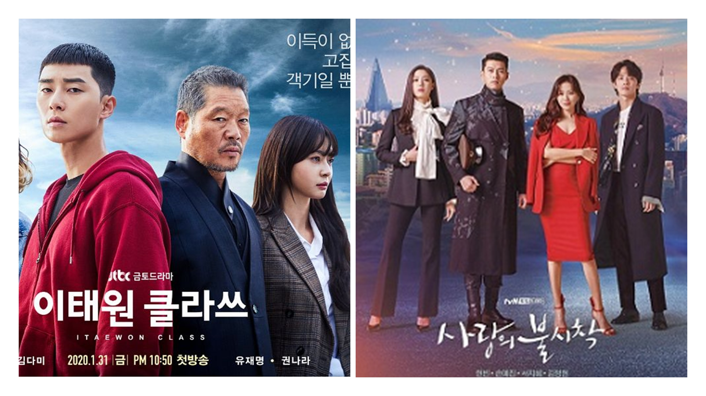
</p>

## The Difference Between Multi-Labels & Multi-Class
This project also allows us to be more clear how to set up our data. Since a movie can have more than 1 genre, we would be looking at multi-label classification as opposed to multi-classification.

To differentiate between both, suppose we are given images of shapes to be classified into their corresponding categories. For ease of understanding, let’s assume there are a total of 4 shapes (circle, rectangle, square and triangle) in which a given image can be classified. Now, there can be two scenarios:

  1. Multi-class
  Each image contains only a single shape (either of the above 4 shapes) and hence, it can only be classified in one of the 4 
  classes.
  
  2. Multi-label
  The image might contain more than one shape (from the above 4 categories) and hence the image will belong to more than 
  one shape.


## How to Get Started

With this understanding, the steps to begin the work on the movie multi-label image classification will be as follow:

### Gather Images

We need images of movie and drama posters and have a folder containing all the images for training the model. Along with images, we will require the true labels of images in the form of a .csv file that contains the names of all the training images and their corresponding true labels.


### Load and pre-process the data

The images will be loaded and pre-processed and split for training and validation.
 
### Determine the model’s architecture

The next step is to define the architecture of the model. This includes deciding the number of hidden layers, number of neurons in each layer, activation function, and so on. We will use a pre-trained model and weights.
 
### Train and validate the model

The training images and their corresponding true labels will be used to train the model. We also pass the validation images to help us validate how well the model will perform on unseen data.
 
### Make predictions on new images

Finally, we will use the trained model to get predictions on new images.

## Buidling our Image Classfier

Our aim is to predict the genre of a movie using just its poster image. A movie can belong to more than one genre and it doesn’t just have to belong to one category, like action or comedy. The movie can be a combination of two or more genres. Hence, multi-label image classification.

The dataset we’ll be using contains the poster images of several multi-genre movies. I have made some changes in the dataset and converted it into a structured format, i.e. a folder containing the images and a .csv file for true labels. You can download the structured dataset from [here](https://drive.google.com/file/d/1iQV5kKF_KGZL9ALx9MMXk_Lg7PklBLCE/view). 

Below are a few posters from our dataset:

<p align="center">
  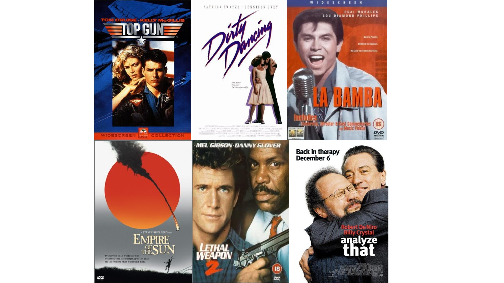
</p>

## The Codes
First, import all the required Python libraries:

```
import tensorflow.keras
from tensorflow.keras.models import Sequential
from tensorflow.keras.layers import Dense, Dropout, Flatten
from tensorflow.keras.layers import Conv2D, MaxPooling2D
from tensorflow.keras.utils import to_categorical
from tensorflow.keras.preprocessing import image
import numpy as np
import pandas as pd
import matplotlib.pyplot as plt
from sklearn.model_selection import train_test_split
from tqdm import tqdm
from tensorflow.keras.applications.inception_v3 import InceptionV3
from tensorflow.keras.applications.vgg19 import VGG19
from tensorflow.keras.regularizers import l2
from tensorflow.keras.models import Sequential, Model
from tensorflow.keras.layers import Dense, Dropout, Activation, Flatten
from tensorflow.keras.layers import Convolution2D, MaxPooling2D, ZeroPadding2D, GlobalAveragePooling2D, AveragePooling2D
%matplotlib inline
```
```
train = pd.read_csv('data/train.csv')    # reading the csv file
train.head()      # printing first five rows of the file
```
<p align="center">
  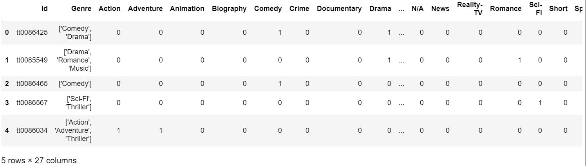
</p>

```
train.columns
```
<p align="center">
  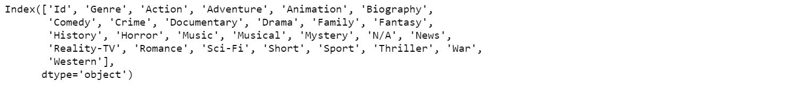
</p>

The genre column contains the list for each image which specifies the genre of that movie. So, from the head of the .csv file, the genre of the first image is Comedy and Drama. The remaining 25 columns are the one-hot encoded columns. So, if a movie belongs any of the 25 genrew, its value will be 1, otherwise 0. The image can belong up to 25 different genres.

We will now load and preprocessing the data and read in all the training images:

```
train_image = []
for i in tqdm(range(train.shape[0])):
    img = image.load_img('data/Images/'+train['Id'][i]+'.jpg',target_size=(128,128,3))
    img = image.img_to_array(img)
    img = img/255
    train_image.append(img)
X = np.array(train_image)
```
The images have been resized to 128 x 128 x 3. This is mainly to allow processing to be done faster since running on a local machine GPU, my jupyter notebook also kept giving a dead kernel which suggests running out of memory space.

Let's look at the shape of the data we are dealing with:
```
X.shape
```
(7254, 128, 128, 3)

```
plt.imshow(X[1001])
train['Genre'][1001]
```

<p align="center">
  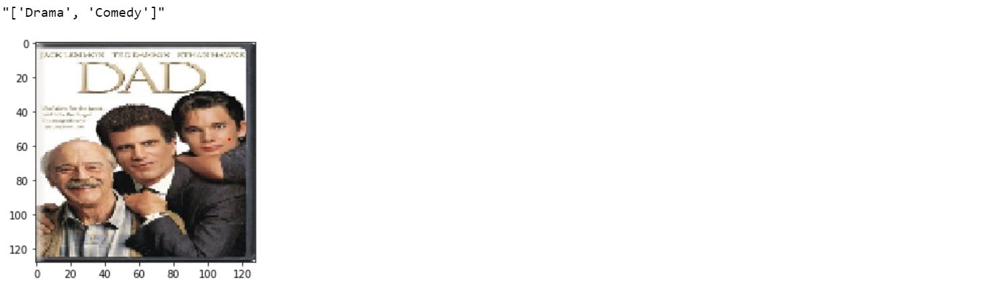
</p>

This movie has 2 genres – Comedy and Drama. The next thing our model would require is the true label(s) for all these images. 
For each image, we will have 25 targets, i.e. All these 25 targets will have a value of either 0 or 1.
The Id and genre columns from the train file and convert the remaining columns to an array which will be the target for our images:
```
y = np.array(train.drop(['Id', 'Genre'],axis=1))
y.shape
```
(7254, 25)

The shape of the output array is (7254, 25) as we expected. We create a validation set which will help us check the performance of our model on unseen data. We will randomly separate 20% of the images as our validation set:
```
X_train, X_test, y_train, y_test = train_test_split(X, y, random_state=100, test_size=0.2)
```
## Model Architecture
The next step is to define the architecture of our model. The output layer will have 25 neurons (equal to the number of genres) and We will use sigmoid as the activation function.

I will be using the vgg19 model and adding it on to solve this problem by changing the number of hidden layers, activation functions and other hyperparameters.
```
vgg19 = VGG19(weights='imagenet', include_top=False)
x = vgg19.output
x = GlobalAveragePooling2D()(x)
x = Dense(128,activation='relu')(x)
x = Dropout(0.2)(x)
predictions = Dense(25,kernel_regularizer=l2(0.005), activation='sigmoid')(x)
model = Model(inputs=vgg19.input, outputs=predictions)
```
Take a look at our model summary:
```
model.summary()
```
<p align="center">
  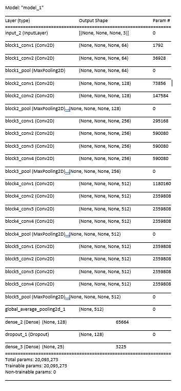
</p>


We will use binary_crossentropy as the loss function and ADAM as the optimizer:
```
model.compile(optimizer='adam', loss='binary_crossentropy', metrics=['accuracy'])
model.fit(X_train, y_train, epochs=20, validation_data=(X_test, y_test), batch_size=32)
```
We will train the model for 20 epochs and also pass the validation data which we created earlier in order to validate the model’s performance:

<p align="center">
  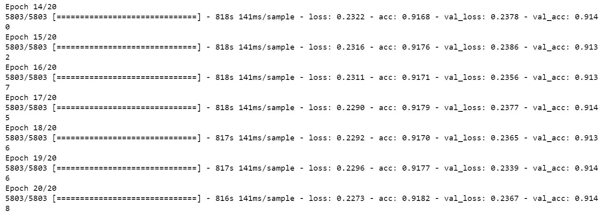
</p>

We can see that the training loss went below to 0.23 and the validation loss is also not too far off. Validation accuracy was slightly over 91%. (Trainng up to 200 epochs did not improve the results much) 


## Making Predictions

Now that we have trained our model, we can now pre-process and predict the genre for these posters using our trained model. The model will tell us the probability for each genre and we will take the top 3 predicted genres from that.

```
img = image.load_img('data/testing/inception.jpg',target_size=(128,128,3))
img = image.img_to_array(img)
img = img/255
classes = np.array(train.columns[2:])
proba = model.predict(img.reshape(1,128,128,3))
top_3 = np.argsort(proba[0])[:-4:-1]
for i in range(3):
    print("{}".format(classes[top_3[i]])+" ({:.3})".format(proba[0][top_3[i]]))
plt.imshow(img)
```
## Predictions


One of the classic movies of all time - The Godfather 2. Results are not too bad - Drama, Crime and Thriller.
<p align="left">
  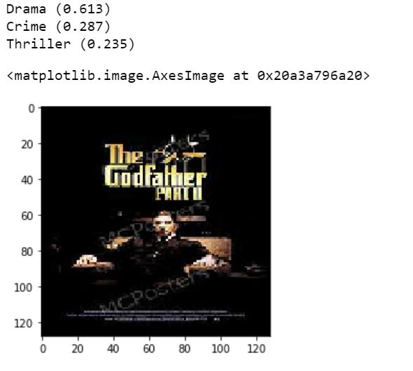
</p>

Next another great movie Inception. Pretty accurate I would think as well.
<p align="left">
  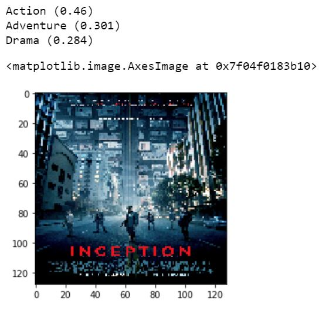
</p>

Haven't watch this yet but wiki describes this as a dark comedy. I suppose the predicted genres are not too far off.
<p align="left">
  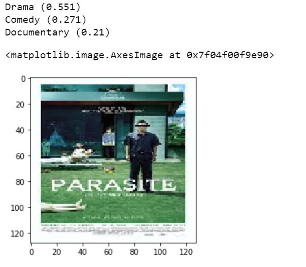
</p>


Let's try it out for Korean dramas. Let's see how our model does.

Wiki describes Crash Landing On You as a drama cum romance. Relatively accurate assessment I would think. The genre with highest probabililty right on the mark as a drama. It also picks out romance.
<p align="left">
  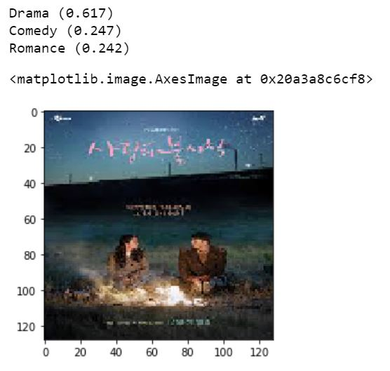
</p>

 
Korean Drama - Itaewon Class. Again pretty much accurate on it being a drama.

<p align="left">
  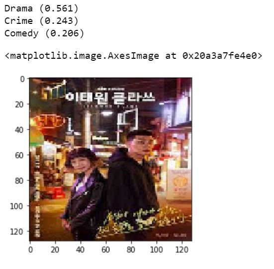
</p>
Afternote: I actually watch this over the last 3 days - Its actually a story about revenge. 


We can see that the model is able to predict the genres event or Korean dramas just by seeing their poster.

## Next Steps
Our VGG19 model performed quite well even though we only had around 7000 images for training it.

We can try and collect more updated posters as well as posters from other countries' movies such as Indian and Korean movies and dramas for training. The genre categories can have comparatively equal distribution to reduce overfitting. I would also relook and update and sub categorise some of the genres such as Comedy which may be too broad. We see it appear many times in our results. In our Parasite example which is a dark comedy, perhaps not too suitable to be labelled in the same category as funnier comedies.
 
## Conclusion
Using pre-trained weights and models for our VGG19 model, we managed to achieve slightly more accurate results. We could also extend the model to predict genres using posters of popular Korean dramas and movies.


